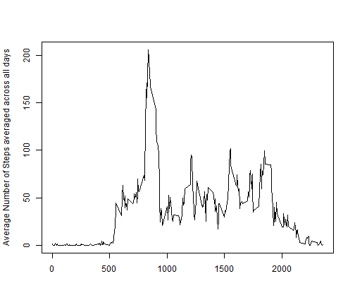

# Reproducible Research - Peer Assessment1
## Loading and Processing the data
Read the data into R and sum the steps across each day

```r
activity<-read.csv("activity.csv")
library(plyr)
tot_steps<-ddply(activity,.(date),summarize,sum_steps=sum(steps))
```
## Mean Total number of steps taken each day
 Histogram of the total number of steps taken each day, calculate and report mean and median

```r
hist(tot_steps$sum_steps,main="Plot1 - Total Steps taken each day",xlab="Total Steps",ylab="Frequency",col="red")
```

 

```r
mean(tot_steps$sum_steps,na.rm=TRUE)
```

```
## [1] 10766
```

```r
median(tot_steps$sum_steps,na.rm=TRUE)
```

```
## [1] 10765
```

## Average Daily activity Pattern
Plot the 5 minute interval and the average number of steps taken averaged across all days
Report the 5-minute that contain the maximum number of steps on average across all days 

```r
avg_steps<-ddply(activity,.(interval),summarize,avg_steps=mean(steps,na.rm=TRUE))
plot(avg_steps$interval,avg_steps$avg_steps,
     ylab="Average Number of Steps averaged across all days",xlab=" ",type="l")
```

 

```r
avg_steps[avg_steps$avg_steps==max(avg_steps$avg_steps),]
```

```
##     interval avg_steps
## 104      835     206.2
```
## Imputing missing values
Calculate and report the total number of rows with missing values 

```r
activity_good<-complete.cases(activity)
activity_nomiss<-activity[activity_good,]
nrow(activity)-nrow(activity_nomiss)
```

```
## [1] 2304
```
Fill in the missing data with the mean for that 5 minute interval and create a new dataset with the imputed values

```r
activity_impute<-join(activity,avg_steps)
```

```
## Joining by: interval
```

```r
activity_impute$steps[is.na(activity_impute$steps)]<-activity_impute$avg_steps
```

```
## Warning: number of items to replace is not a multiple of replacement
## length
```
## Mean Total number of steps taken each day after Imputing missing values
 Histogram of the total number of steps taken each day and report the new mean and median

```r
tot_steps_imp<-ddply(activity_impute,.(date),summarize,sum_steps=sum(steps))
hist(tot_steps_imp$sum_steps,main="Plot1 - Total Steps taken each day after imputing",xlab="Total Steps",ylab="Frequency",col="red")
```

 

```r
mean(tot_steps_imp$sum_steps,na.rm=TRUE)
```

```
## [1] 10766
```

```r
median(tot_steps_imp$sum_steps,na.rm=TRUE)
```

```
## [1] 10766
```
Mean remains the same and median is 1 unit higher from the estimates before imputing
The mean and median have the same value in the imputed dataset
The missing values or the NAs from the total number of steps per day have now taken the value of mean number of steps per day 

##Difference in activity patterns between weekdays and weekends
create a factor variable indicating if the date is a weekday or weekend
Make a panel plot of the 5-minute interval and the average number of steps taken averaged across all weekdays and weekends

```r
activity_impute$wdays<-as.factor(ifelse(weekdays(as.Date(activity_impute$date)) %in% c("Saturday","Sunday"), "Weekend", "Weekday"))
avg_steps_days<-ddply(activity_impute,.(interval,wdays),summarize,avg_steps_days=mean(steps))
weekend_dat<-avg_steps_days[avg_steps_days$wdays=="Weekend",]
weekday_dat<-avg_steps_days[avg_steps_days$wdays=="Weekday",]
par(mfrow=c(2,1))
plot(weekend_dat$interval,weekend_dat$avg_steps_days,main="weekend",ylab="Average Number of Steps averaged across weekends",xlab="Interval",type="l")
plot(weekday_dat$interval,weekday_dat$avg_steps_days,main="weekday",ylab="Average Number of Steps averaged across weekdays",xlab="Interval",type="l")
```

 
